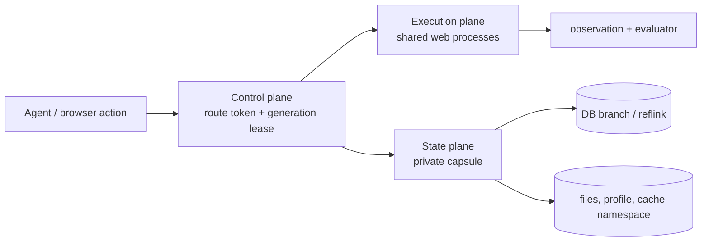

# Architecture

CUA-Sandbox has three planes, matching the CUA-Sandbox design.



## State plane

A task state contract maps logical resources to a state class, backend adapter,
and lifecycle policy. The three state classes are:

- **authoritative**: databases, user files, uploads, and other data that must
  survive and remain private;
- **derived**: caches, search indexes, and generated data that can be rebuilt
  in a private namespace; and
- **ephemeral**: profiles, IPC endpoints, display resources, and temporary
  process handles that are recreated when a capsule is activated.

`AppStateAudit` and `StateCapabilityGate` load these contracts and reject a
DB-mode task when any mutable component is unreviewed or unsupported. This
fail-closed admission check is part of the isolation boundary, not just a
benchmark convenience.

The adapters implement a common lifecycle vocabulary:

```text
prepare → quiesce → checkpoint/fork/reset → activate → cleanup
```

PostgreSQL uses database branches or templates. Shopping/CMS can use the
`MySQLXFSReflinkManager` against a reflink-capable XFS volume. Files and
application-specific state use `NonDBStateCoordinator` and its backend
adapters. A backend may be coarse-grained when a fine-grained adapter is not
safe; private correctness takes precedence over sharing.

## Execution plane

`WebAgentEnv` owns the Playwright browser context and exposes the same action,
observation, and evaluator interface as the isolated WebArena environment. In
`db` mode it prepares one `DBAgentSession` per logical task, installs route
header injection for configured origins, and points all requests at the shared
application host.

The application receives a signed `X-Agent-Route` capability. The browser does
not receive a database name. `TrustedDBRouter` verifies the token, acquires a
request lease, and publishes the resolved route in the request-local context.
Database connectors and application adapters read that context to select the
private branch and namespaces. The lease is released even when application
code raises an exception.

## Control plane and atomic lifecycle

`SQLiteRouteRegistry` stores the active route, branch, generation, lifecycle
state, in-flight request count, and pending background-job count. Request
admission and the counter increment happen in one SQLite write transaction, so
a request cannot enter after a route has been frozen.

Every reset, restore, clone, or fork uses this protocol:

1. freeze the route;
2. drain in-flight HTTP requests and background jobs;
3. release application pools that would retain the old branch;
4. stage all successor capsule components;
5. publish the complete binding table and increment the generation atomically;
6. run readiness checks, then activate/resume the route; or retain the old
   generation if staging fails.

Generation-scoped leases prevent delayed requests and evaluator reads from
crossing the transition. Shared processes remain alive throughout the state
operation; only the capsule and its bindings change.

## Source map

| Concern | Code |
| --- | --- |
| Browser lifecycle and action execution | `rl_web_agent/env.py` |
| Per-task database/session setup | `rl_web_agent/isolation/db_isolation.py` |
| Signed capability and request-local routing | `rl_web_agent/isolation/route_token.py`, `db_routing.py` |
| Transactional route registry | `rl_web_agent/isolation/route_registry.py` |
| Non-database state | `rl_web_agent/isolation/non_db_state.py` |
| MySQL/XFS copy-on-write | `rl_web_agent/isolation/mysql_xfs_isolation.py` |
| State coverage and task admission | `rl_web_agent/isolation/state_audit.py` |
| Registry HTTP sidecar | `rl_web_agent/entrypoints/route_registry_server.py` |
| Batch rollout driver | `rl_web_agent/entrypoints/batch_agent.py` |
